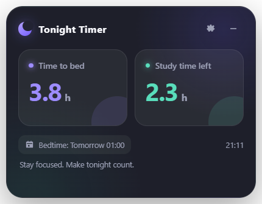

<p align="center">
  
</p>

<h1 align="center">今晚还有多久</h1>

<p align="center">
  一个简洁的 Windows 桌面小组件，告诉你距离睡觉还有多久，以及今晚还剩多少可学习时间。
</p>

<p align="center">
  <strong>Windows 10/11 · 中文/English · 纯本地运行</strong>
</p>

<p align="center">简体中文 · <a href="README.md">English</a></p>

## 为什么做这个小程序

> 明日复明日，明日何其多。

有时因为拖延，到了晚上我会突然发现：一天好像又过去了，今天似乎又一事无成。但真的是这样吗？

即使晚上 9:30 才开始，也许你仍然拥有 2.5 小时，可以放下杂念、沉浸学习。不要再想着“明天开始”——**就从今晚开始吧。**

这个小组件不会替你完成计划，但它会提醒你：今天还没有结束，你依然可以为自己做一点事情。

## 它能做什么

设置睡觉时间后，小组件会持续显示：

- **距离睡觉**：从现在到下一次睡觉时间的真实剩余时长。
- **还可以学习**：距离睡觉的时间减去睡前预留时间，默认预留 1.5 小时。

程序能够正确处理跨午夜时间。例如现在是 23:30、睡觉时间是次日 01:00，剩余时间会显示为 **1.5 小时**，不会出现负数或错误的 23.5 小时。

```text
可学习时间 = 距离睡觉的时间 − 睡前预留时间
```

## 界面预览

| 中文 | English |
|:---:|:---:|
|  |  |

## 主要功能

- 正确计算跨午夜的睡觉倒计时
- 支持小时或分钟显示
- 可以修改睡前预留时间
- 应用内所有文字支持中文和英文
- 深色、浅色和跟随系统主题
- 始终置顶和锁定位置
- Windows 开机自动启动
- 支持系统托盘隐藏与恢复
- 设置和窗口位置保存在本地
- 不需要账号，不联网，不上传数据

## 下载与安装

进入仓库的 **Releases** 页面，下载其中一个文件：

- `TonightTimer-Setup-1.1.0-x64.exe`：安装版，创建桌面和开始菜单快捷方式
- `TonightTimer-Portable-1.1.0-x64.exe`：便携版，无需安装，双击即可运行

目前程序没有购买商业代码签名证书，因此 Windows SmartScreen 首次运行时可能显示“未知发布者”。确认文件来自本仓库后，选择 **更多信息 → 仍要运行** 即可。

## 快速使用

1. 启动程序，点击右上角齿轮。
2. 设置睡觉时间；日常使用建议选择“自动判断”。
3. 根据需要修改睡前预留时间。
4. 在“语言”中选择“中文”或“English”。
5. 拖动标题区域调整位置，完成后可开启“锁定位置”。

右上角减号会把程序隐藏到系统托盘；点击托盘中的月亮图标即可重新显示。

## 从源码运行

需要 Windows 和 Node.js 20 或更高版本。

```bash
npm install
npm start
npm test
npm run dist
```

打包后的文件位于 `release/` 目录。

## 隐私

所有设置仅保存在你的电脑上。程序不需要登录，也不会通过互联网发送任何数据。

## 开源许可

采用 [MIT License](LICENSE) 开源许可。
